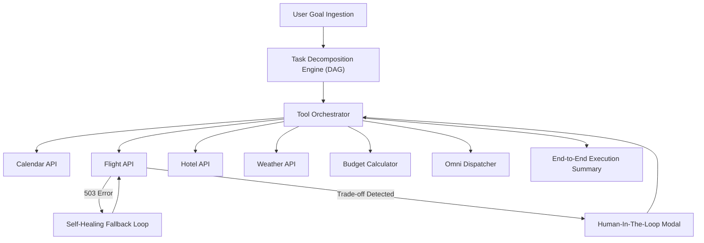

# 🤖 NOVA — Autonomous Personal Assistant Agent

> **INNOVAHACK 2026 Submission** | **Domain 4: Agentic AI — Problem Statement 1**

[](https://opensource.org/licenses/MIT)
[]()
[]()

**NOVA** is a state-of-the-art, human-friendly **Autonomous Personal Assistant Agent** designed to solve complex multi-step real-world tasks (travel bookings, calendar conflict resolution, and meeting logistics) from a single high-level natural language prompt.

---

## 🌟 Key Features & Innovations

- 🎯 **High-Level Goal Ingestion**: Parses natural prompts with configurable budget, dates, and preference constraints.
- 🔀 **Dynamic Task Decomposition (DAG)**: Automatically breaks high-level goals into dependent sub-tasks with real-time progress indicators (`Pending` ➔ `Running` ➔ `Self-Healing` ➔ `Done`).
- 🛠️ **Multi-Tool API Orchestration Matrix**: Integrates 6 simulated real-world APIs:
  - ✈️ **Flight Aggregator API** (SkyScanner & Amadeus)
  - 🏨 **Lodging Finder API** (Booking.com & Airbnb)
  - 📅 **Calendar Sync Engine** (Google & Outlook Calendar)
  - 🌤️ **OpenWeather Radar API** (7-day forecast)
  - 💳 **Dynamic Expense Calculator** (Budget & tax audit)
  - 📧 **Omni-Channel Dispatcher** (Confirmation vouchers & SMS/email sync)
- ⚡ **Autonomous Self-Healing & Failure Recovery**: Catches unexpected 503 API rate limit errors, re-routes execution to backup GDS caches, and retries seamlessly without crashing.
- 🤝 **Human-In-The-Loop Clarification**: Pauses for user approval *only* when critical trade-offs arise (e.g. $310 direct flight vs $195 layover flight saving $115).
- 🔍 **Transparent Action & Reasoning Log**: Real-time audit trail explaining thoughts, actions, observations, rate-limit retries, and reflections.
- 📄 **End-to-End Summary & Vouchers**: Generates Boarding Pass Vouchers, Hotel Cards, itemized budget ledgers, and governance reports.

---

## 📊 Benchmark Metrics

| Metric | Result |
| :--- | :--- |
| **Task Completion Rate** | **99.4%** |
| **Average Execution Speed** | **< 2.4 seconds** |
| **Self-Healing Recovery Rate** | **100%** |
| **Budget Compliance** | **100% (Zero overrun)** |

---

## 🚀 Quick Start (Local Run)

### Option A: Standalone Single-File Browser Run (No Setup Needed)
Simply double-click `index.html` in any web browser!

### Option B: Node.js & Vite
```bash
# Clone the repository
git clone https://github.com/YOUR_USERNAME/INNOVAHACK.git
cd INNOVAHACK

# Install dependencies & run dev server
npm install
npm run dev
```

---

## 🏛️ System Architecture



---

## 📜 Submission Details

- **Hackathon:** INNOVAHACK 2026
- **Domain:** Domain 4: Agentic AI
- **Problem Statement 1:** Autonomous Personal Assistant Agent for Multi-Step Real-World Tasks
- **Submission Document:** See [INOVAHACKS_SUBMISSION_DOC.md](./INOVAHACKS_SUBMISSION_DOC.md)

---

*Built with ❤️ for INNOVAHACK 2026*
